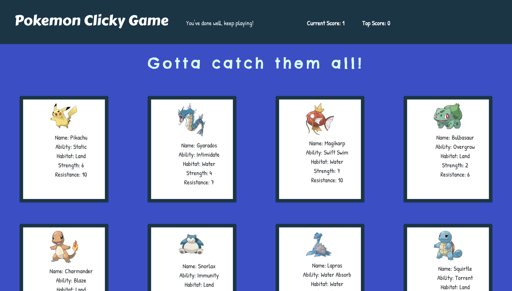

# Pokemon Clicky Game (a.k.a. Memory Game)

### A react-based application built with 4 components: Wrapper, Title, Header, and GameCard which allows users to enjoy the pokemon-themed memory game. 

How the game works:

You will earn points for every unique card that you have selected - this means that if you have previously selected the card in the current round, then you will lose and the game restarts. 

### To see, learn, and enjoy more: join us <a href="https://gentle-crag-42523.herokuapp.com/"> here </a>
